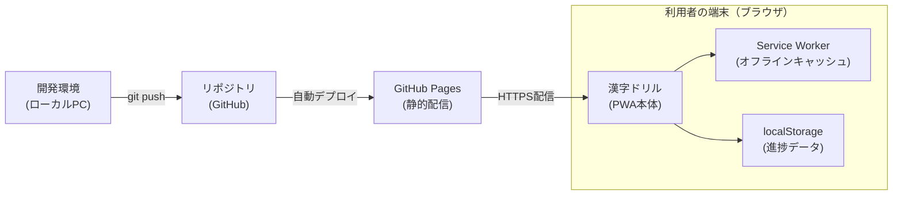

# 漢字ドリル ✏️

小学生（2〜5年生、5年生重点）向けの漢字学習Webアプリ（PWA）。

- **毎日10問**のテストを紙に手書きで回答 → PCやタブレットで答え合わせ（○×自己採点）
- 出題は5〜10文字程度の短文（例：「みどりいろのえきたい」→ みどりいろの**液体**）
- 前日にまちがえた問題を翌日に優先出題
- **学習カレンダー**（実施日に自動チェック）と**ヒートマップ**（学年別・正解率で色分け）で進捗を可視化
- 連続日数・バッジで継続をサポート

## 使い方

ブラウザで公開URLを開くだけ。スマホ/タブレットでは「ホーム画面に追加」でアプリのように使えます（オフライン起動対応）。

## 技術

- HTML / CSS / JavaScript（フレームワーク不使用・単一ページ）
- データは端末内の `localStorage` に保存（外部送信なし・1台運用）
- PWA（`manifest.json` + Service Worker）

## システム構成

- **開発環境**：`index.html`・`kanji-data.js`・`sentence-data.js` 等を編集し、`git push` でリポジトリへ反映
- **GitHub Pages**：リポジトリの内容をそのまま静的ホスティング（サーバーサイド処理なし）
- **利用者の端末**：PWA本体がService Workerでオフラインキャッシュを持ち、進捗データはlocalStorageに保存（外部送信なし・端末ごとに独立）

## ファイル構成

| ファイル | 役割 |
|---------|------|
| `index.html` | アプリ本体（UI・ロジック） |
| `kanji-data.js` | 2〜5年生の漢字データ（読み・熟語） |
| `sentence-data.js` | 出題用の短文テンプレート |
| `manifest.json` / `sw.js` | PWA設定・オフライン用Service Worker |
| `icons/` | アプリアイコン |
| `scripts/` | データ・アイコン生成スクリプト（開発用） |
| `漢字学習アプリ要件定義書.md` | 要件定義書 |
